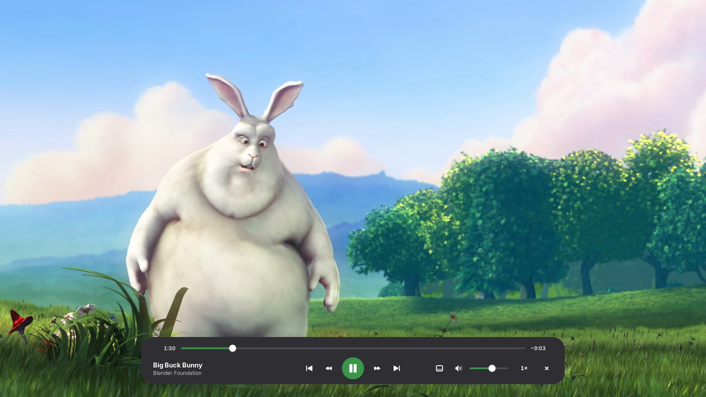
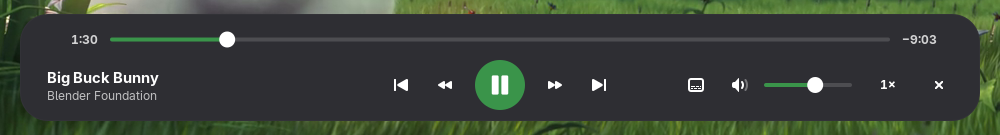
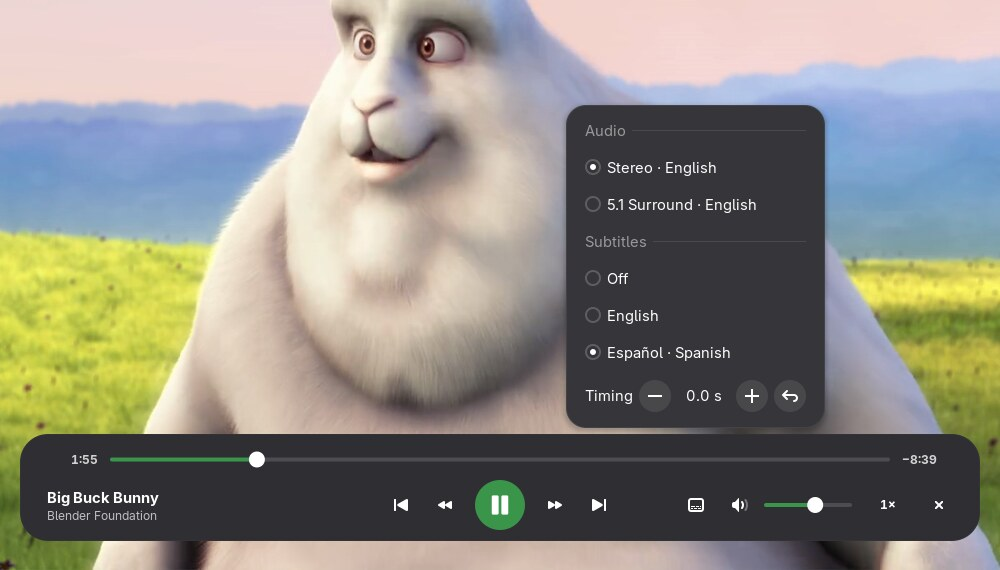
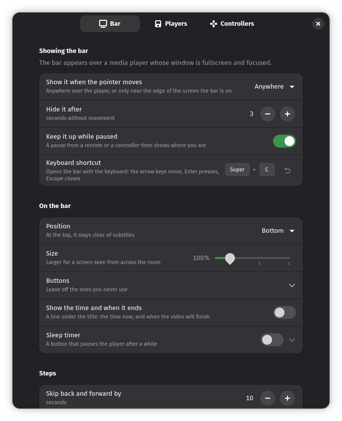
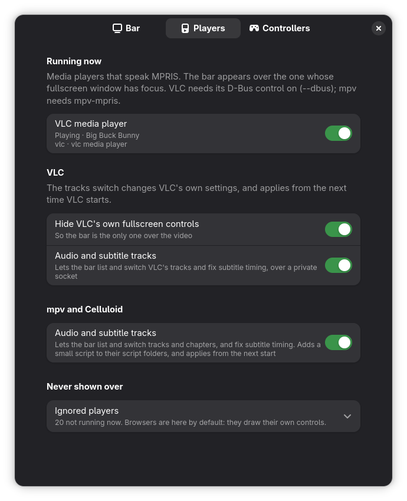
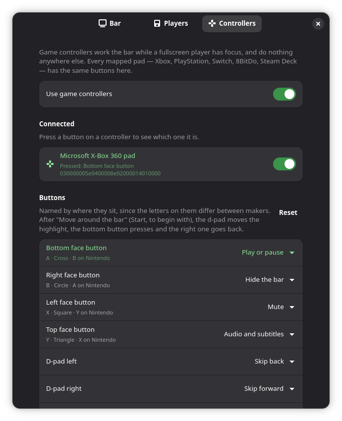

# Media Controls

A control bar for fullscreen video, drawn by GNOME Shell over the player: seek,
pause, skip, volume and speed, from the mouse, the keyboard or a game controller.
It works with VLC, mpv, Celluloid, Showtime and any other player that shows up in
GNOME's media controls.



- **Looks like GNOME.** It uses the shell's own sliders, buttons and menus, in
  your accent colour, and follows High Contrast and shell themes.
- **Audio, subtitles and timing.** Pick the audio track and subtitles, nudge
  out-of-sync subtitles until they line up, and move between chapters. (VLC,
  and mpv or Celluloid with their control socket.)
- **Any controller, and touch.** Xbox, PlayStation, Switch, 8BitDo, Steam Deck.
  Buttons go by where they sit, so every pad works the same. On a touchscreen,
  tap the video to bring the bar up and tap outside it to put it away.
- **Sized for the room.** One slider makes the whole bar bigger for a TV. Put
  it at the top of the screen to keep it clear of subtitles.
- **Clock and sleep timer.** See when the film will end, or have it pause after
  15 minutes to 2 hours, at the end of the file, or after a few episodes. Both
  are optional.
- **Only where you're looking.** Just the focused fullscreen player gets the
  bar, so a controller in a game never pauses your film.

## Use



Play something full screen and move the mouse. The bar hides again after 3
seconds without movement, and stays up while the video is paused.

- **Mouse:** scroll over the bar to skip back or forward 10 seconds a notch.
  Click the time at the end of the seek bar to switch between the time left and
  the full length.
- **Keyboard:** Super+C opens the bar. The arrow keys move around it, Enter
  presses and Escape (or Super+C again) closes it. While the bar is closed, keys
  go to the player as usual.

The preferences change all of this: show the bar only near the edge of the
screen or never on movement, how long it stays, how far a skip goes, and which
buttons it has. A hidden button still works from the keyboard and controllers.

### Audio and subtitles



With VLC, mpv or Celluloid, the button next to the volume opens this. Pick an
audio track and subtitles, then use − and + to move the subtitles by 0.1 s until
they line up. Files with chapters get a row to move between them. Each needs one
switch turned on first (see [VLC](#vlc) and [mpv and Celluloid](#mpv-and-celluloid)).
Showtime has no way to give these.

## Controllers and remotes

A controller does something only while a fullscreen player has focus, and it
is never taken away from other apps: a game beside the player still sees every
press. Buttons are named by where they sit, so the bottom button is A on an
Xbox pad, Cross on a PlayStation pad and B on a Nintendo one. Out of the box:

| Button | Does |
|---|---|
| Bottom | Play or pause |
| Right | Hide the bar |
| Left | Mute |
| Top | Audio and subtitles |
| D-pad left and right | Skip back and forward |
| D-pad up and down | Volume up and down |
| Shoulders | Previous and next |
| Triggers | Slower and faster |
| Start | Move around the bar |

Hold a skip or volume button to keep going. Start opens the bar like Super+C:
the d-pad then moves around it, the bottom button presses and the right one
goes back. Every button can be remapped on the Controllers page.

A remote's media keys go to the player as they always have; the bar comes up to
show what they did: a pause, a seek or the next file.

## VLC

VLC works out of the box for everything but the tracks. Switches on the
**Players** page:

- **Hide VLC's own fullscreen controls**, so the bar is the only one over the
  video. The shell hides VLC's controller window while Media Controls is
  enabled, and it is back as soon as the switch or the extension is turned
  off. Nothing in VLC's settings changes.
- **Audio and subtitle tracks** turns on VLC's remote-control interface on a
  private socket in your runtime folder, which the bar uses for the tracks,
  subtitle timing and chapters. It changes VLC's settings file,
  `~/.config/vlc/vlcrc`, only when you turn it on, and applies from the next
  time VLC starts. Only one VLC at a time can use the tracks. A Flatpak VLC
  does not get them yet (it keeps its settings elsewhere); hiding its controls
  works.

## mpv and Celluloid

The **mpv and Celluloid** switch on the **Players** page turns on the same
audio, subtitle, timing and chapter controls for them. It adds a small script
(`media-controls.lua`) to their `scripts` folders, also for their Flatpaks once
they have run, which makes each player open a control socket in your runtime
folder; turning the switch off removes it. It applies from the next time the
player starts. A socket you set yourself (`input-ipc-server`) is used as it is.
Both work as Flatpaks.

## Requirements

- GNOME Shell 50. Shell 48 and 49 have been read through but not run, so they
  are not claimed (`docs/compatibility.md`).
- A player that shows up in GNOME's media controls (MPRIS): VLC (with its D-Bus
  control on, as it is by default), Celluloid, Showtime (GNOME's video player),
  or mpv with [mpv-mpris](https://github.com/hoyon/mpv-mpris). Run mpv with
  `--no-osc` so its own controls stay out of the way. Celluloid and Showtime
  draw theirs beside the bar when the pointer moves, and cannot be told not to.
  Audio and subtitle tracks, subtitle timing and chapters are for VLC, mpv and
  Celluloid; Showtime has no way to give them.
- libmanette, for game controllers. Without it the bar works and the
  controllers are off.

## Install

From source; it is not on extensions.gnome.org yet. You need `make` and
`glib-compile-schemas` (part of GLib).

```bash
git clone https://github.com/Jackicus/GNOME-Media-Controls.git
cd GNOME-Media-Controls
make install
```

Log out and back in (Wayland cannot load a new extension into a running
session), then run `gnome-extensions enable media-controls@jackicus`. For the
tracks, turn on the switches on the Players page and restart the player.

To update: `git pull && make install`, then log out and back in. To remove:
`make uninstall`.

## Preferences

`gnome-extensions prefs media-controls@jackicus` opens them.

<table>
  <tr>
    <td width="33%"></td>
    <td width="33%"></td>
    <td width="33%"></td>
  </tr>
  <tr>
    <td valign="top"><b>Bar</b>: when it shows, how long it stays, where it
    sits, its size, which buttons it has, the clock, the sleep timer and how far
    a skip or volume step goes.</td>
    <td valign="top"><b>Players</b>: the players running now and which get the
    bar, the VLC and the mpv and Celluloid switches, and the players it never
    shows over (browsers, by default: they draw their own controls).</td>
    <td valign="top"><b>Controllers</b>: every pad plugged in, each of which
    can be ignored. Press a button to see which one it is, and choose what each
    does.</td>
  </tr>
</table>

## Troubleshooting

Follow the shell's log while you try again; Media Controls' lines start with
`[Media Controls]`:

```bash
journalctl -f -o cat /usr/bin/gnome-shell | grep -i 'media controls'
```

The preferences window runs in its own process:
`journalctl -f -o cat SYSLOG_IDENTIFIER=org.gnome.Shell.Extensions`. In a
clone, `make status` says what is installed and enabled, and `make logs`
follows the log.

- **The bar never shows.** The player's window must be full screen and focused,
  with the overview closed. The Players page lists the players it can see: one
  missing there does not speak MPRIS (mpv needs mpv-mpris), and one under
  Ignored players never gets the bar.
- **No audio-and-subtitles button.** It is for VLC, mpv and Celluloid. Turn on
  **Audio and subtitle tracks** (VLC) or the **mpv and Celluloid** switch on the
  Players page, restart the player and give it a few seconds. A second VLC does
  not get it while the first holds the socket. A Flatpak Celluloid or mpv that
  has never been run has no config folder yet: run it once, then turn the switch
  off and on.
- **VLC's own controls still show.** Turn on **Hide VLC's own fullscreen
  controls** on the Players page. It applies to a running VLC at once.
- **VLC's own controls are missing with the extension off.** An older version
  hid them by writing `qt-fs-controller=0` into `~/.config/vlc/vlcrc`; delete
  that line.
- **Escape left fullscreen.** While the bar does not hold the keyboard, Escape
  goes to the player, and VLC's Escape leaves fullscreen.
- **Controllers do nothing.** Check that libmanette is installed (the log says
  "libmanette is not installed" otherwise), that **Use game controllers** is on
  and the pad is not switched off on the Controllers page, and that a
  fullscreen player has focus.
- **A subtitle did not change at once.** The line already on screen stays; the
  next one is in the new track.

## Development

`make link` installs the extension as links to `src/`, `make reload` loads your
edits, and `make check` runs ESLint and the settings schema check, as CI does.
[CONTRIBUTING.md](CONTRIBUTING.md) has the rest. `docs/publishing.md` covers
building the extensions.gnome.org zip and the review guidelines.

## Licence

GPL-2.0-or-later. See [LICENSE](LICENSE).

## Credits

The screenshots show [Big Buck Bunny](https://peach.blender.org/), © 2008
Blender Foundation,
[CC BY 3.0](https://creativecommons.org/licenses/by/3.0/), with captions added
for the demo. `make demo-clip` builds that copy.

VLC is a trademark of VideoLAN. Xbox, PlayStation, Nintendo Switch, 8BitDo and
Steam Deck are trademarks of their owners. This project is not affiliated with
or endorsed by any of them.
